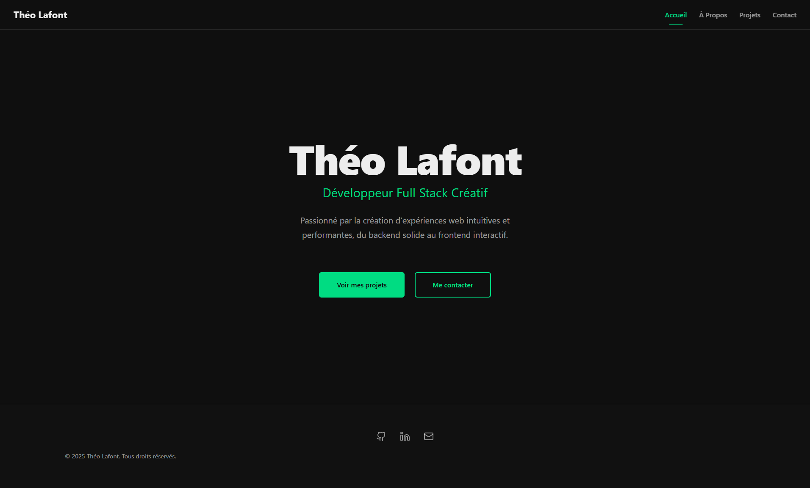

# Portfolio Théo Lafont



Bienvenue sur le dépôt de mon portfolio personnel ! Ce projet a été développé avec React et Vite pour présenter mes compétences en tant que Développeur Full Stack Créatif, mettre en avant mes projets significatifs (même si ce ne sont pas les plus "beaux", ils me sont chers !) et offrir un moyen de me contacter.

**(Déploiement sur Netlify prévu prochainement)**
<!-- Une fois déployé, remplace la ligne ci-dessus par : -->
<!-- **[Voir la démo live]([URL_DE_VOTRE_SITE_NETLIFY])** -->

## ✨ Fonctionnalités

*   **Page d'Accueil :** Présentation rapide et accroche.
*   **Section À Propos :** Informations plus détaillées sur mon profil et mes motivations.
*   **Section Projets :** Mise en avant de mes réalisations clés avec descriptions.
*   **Page de Contact :** Formulaire fonctionnel utilisant Formspree pour me joindre facilement.
*   **Navigation fluide :** Routage géré par React Router DOM.
*   **Animations subtiles :** Interface agrémentée d'animations avec Framer Motion.
*   **Responsive Design :** Adapté pour une consultation optimale sur différents appareils.

## 🛠️ Technologies Utilisées

*   **Frontend:**
    *   [React](https://reactjs.org/) (initialisé avec [Vite](https://vitejs.dev/))
    *   [JavaScript](https://developer.mozilla.org/fr/docs/Web/JavaScript)
    *   CSS Vanilla (CSS pur)
    *   [React Router DOM](https://reactrouter.com/) pour le routage côté client.
    *   [Framer Motion](https://www.framer.com/motion/) pour les animations.
*   **Outils:**
    *   [Vite](https://vitejs.dev/) comme bundler et serveur de développement rapide.
    *   [Git](https://git-scm.com/) & [GitHub](https://github.com) pour le versioning.
    *   [NPM](https://www.npmjs.com/) pour la gestion des dépendances.
*   **Services Externes:**
    *   [Formspree](https://formspree.io/) pour la gestion du formulaire de contact.
    *   (Bientôt) [Netlify](https://www.netlify.com/) pour l'hébergement et le déploiement continu.

## 🚀 Lancer le projet localement

Assurez-vous d'avoir [Node.js](https://nodejs.org/) (qui inclut npm) installé sur votre machine.

1.  **Clonez le dépôt :**
    ```bash
    git clone [URL_DE_VOTRE_DEPOT_GITHUB.git]
    cd [NOM_DU_DOSSIER_DU_PROJET]
    ```
    *(Remplacez `[URL_DE_VOTRE_DEPOT_GITHUB.git]` par l'URL SSH ou HTTPS de votre dépôt et `[NOM_DU_DOSSIER_DU_PROJET]` par le nom du dossier créé)*

2.  **Installez les dépendances :**
    ```bash
    npm install
    ```

3.  **Lancez le serveur de développement :**
    ```bash
    npm run dev
    ```
    Le site devrait être accessible sur `http://localhost:5173` (ou un port similaire indiqué dans le terminal).

4.  **Pour créer un build de production (si vous modifiez le code) :**
    ```bash
    npm run build
    ```
    Les fichiers optimisés seront générés dans le dossier `dist`.

## 🌱 Objectifs et Apprentissages

L'objectif principal de ce projet était de mieux comprendre React, ses forces, et l'écosystème front-end moderne à travers une application concrète. Cela incluait la gestion des composants, le routage, et l'ajout d'interactions via des animations.

## 🔮 Prochaines Étapes

*   [☑️] Déployer le site sur Netlify.
*   [ ] Compléter et ajouter la section "Mon Parcours".
*   [ ] Remplir tous les liens manquants (profils sociaux, etc.).
*   [ ] (Optionnel) Optimiser davantage les performances et le SEO.

## 📫 Contact

Vous pouvez me retrouver sur :

*   **GitHub :** https://github.com/stormdaemon
*   **LinkedIn :** https://www.linkedin.com/in/th%C3%A9o-lafont-30572b26a/
*   **Email :** Via le [formulaire de contact]([LIEN_VERS_VOTRE_PAGE_CONTACT_UNE_FOIS_DEPLOYEE]) sur le site (une fois déployé).

N'hésitez pas à me contacter pour toute question ou opportunité !

---

_© 2025 Théo Lafont. Tous droits réservés._
